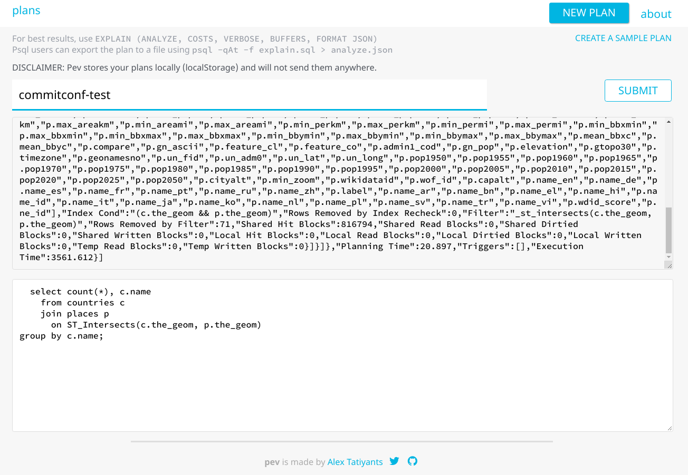
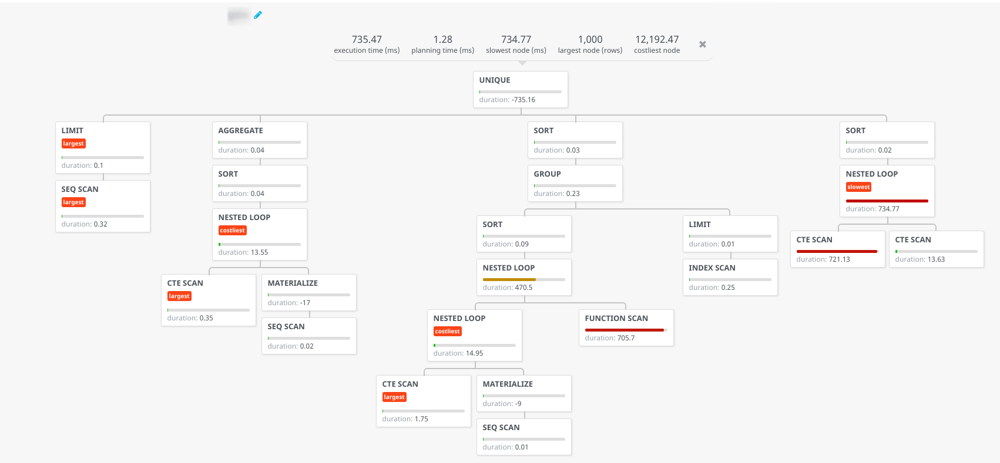
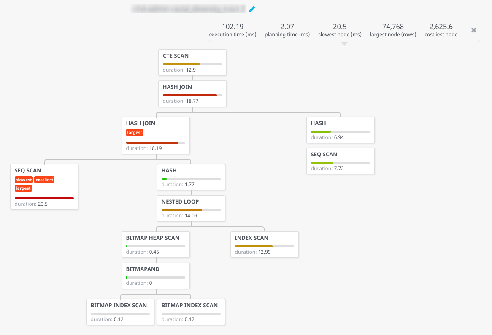
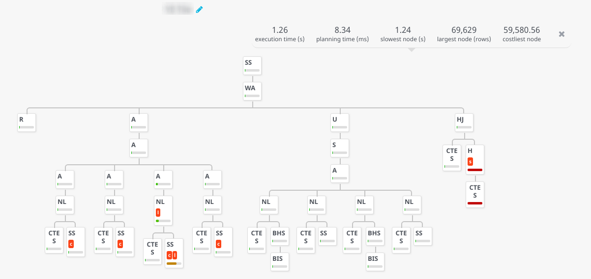
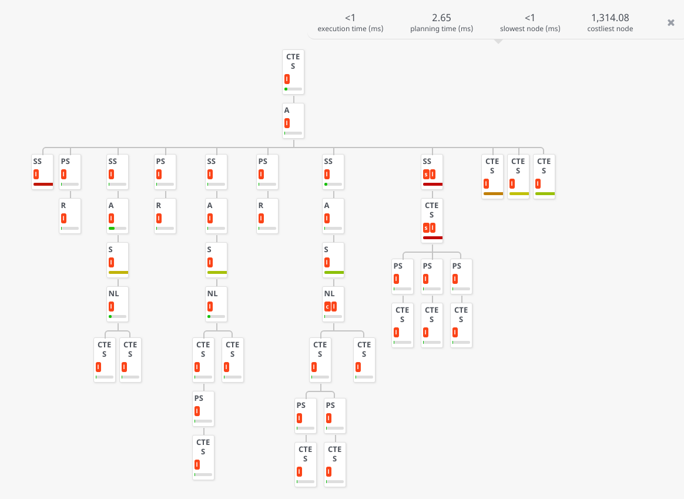

# Execution plans

Checking execution plans is probably one of the first things you usually do to understand why a query is taking too much time. On that regard we highly recommend this guide from Dalibo French experts:

https://www.dalibo.org/_media/understanding_explain.pdf


Postgres provides detailed information on how a query is executed, how much time it actually takes (if you use the `ANALYZE` option), when indexes are used, if sorts are made in memory or it had to go to the hard disk and so on.

With complex queries the execution plan can be hard to read, its tree nature can make hard to find where are the slowest nodes and here is where there's a nice tool we use quite frequently.

From the [Postgres EXPLAIN visualizer](http://tatiyants.com/pev/#/about) website:

<blockquote>
Pev is designed to make Postgres query plans easier to grok. It displays a plan as a tree, with each node representing a step that takes in a row set and produces another. Pev can show you a number of useful things:

* overall plan stats
* individual node stats (duration, row size, cost)
* explanation of what each node does
* outlier nodes
* graph of a specific metric (like cost) for all nodes
* for some nodes, highlighted part of the query which corresponds to the node
</blockquote>

## Exercise

You can use PEV with any of the queries we are using on this workshop we will use here one coming from the `TOAST` exercise as it involves a `JOIN` and is a bit more interesting.

Using any postgres client instead of the normal `EXPLAIN ANALYZE` you run a custom version of the command that outputs more details and using a `JSON` output.

```sql
 EXPLAIN (ANALYZE, COSTS, VERBOSE, BUFFERS, FORMAT JSON)
  select count(*), c.name
    from countries c
    join places p
      on ST_Intersects(c.the_geom, p.the_geom)
group by c.name;
```

Then visit http://tatiyants.com/pev/#/plans/new and paste the output of the `explain` along with the actual query:



The resulting dashboard shows the execution and planning time along with a tree of the execution nodes, you can expand them and get plenty of details of each node.


## Other examples

A few examples of resulting execution trees:









