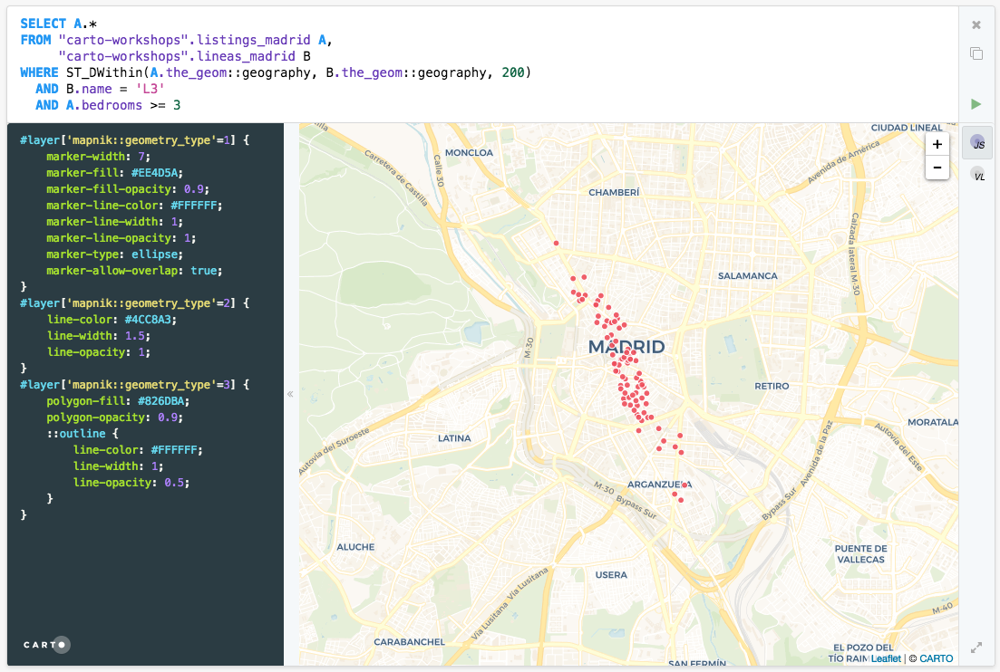

## PostGIS

In this section you’ll have the chance to take a sneak peek of [PostGIS](http://postgis.net/docs/).

### Overview

PostGIS is a PostgreSQL extension that includes:

- geometry and geography data types to store points, lines, polygons, multi, etc.
- [indexing](https://postgis.net/docs/using_postgis_dbmanagement.html#idm2246) on those data types
- a bunch of [functions](https://postgis.net/docs/reference.html) to perform spatial analysis

**Creating a spatial table**

```sql
CREATE TABLE roads (ID serial, ROAD_NAME text, the_geom geometry(POINT, 4326) );
```

**Data ingestion**

```sql
-- geometry as WKT
INSERT INTO roads (id, road_name, the_geom)
  VALUES (1, 'Jeff Rd', ST_GeomFromText('POINT(-126.4 45.32)', 4326));
```

### Set up

For this workshop we will use [CARTO](https://carto.com/) as a convenient way to interact with PostGIS.

Since PostGIS is about storing, querying and analyzing geospatial information we will use [CARTO Franchise](https://franchise.carto.io) as a tool to write and share CARTO PostGIS notebooks.

- Go to https://franchise.carto.io and introduce your credentials:
  - hostname: `carto.com`
  - username: `commitconf-xx`
  - API key: `type your_api_key`

- Alternatively you can use [this blocks](https://bl.ocks.org/rochoa/raw/4e67ec932e8bb6b17831e0f4a2e0e55d/)
  - Introduce your Maps API endpoint
    - `https://{YOUR_USER_NAME}.carto.com/api/v1/map` (i.e. `https://commitconf-01.carto.com/api/v1/map`)
  - Introduce your API key
  - To run and visualize queries:
    - Type a query to any of your datasets in the SQL text area (i.e. `SELECT * FROM ne_10m_populated_places`)
    - Hit Ctrl+S (or Cmd+S in MacOS)

Some tables you have available to you from this account are:

- `"carto-workshops".ne_10m_populated_places_simple`: Natural Earth populated places
- `"carto-workshops".ne_110m_admin_0_countries`: Natural Earth country boundaries
- `"carto-workshops".railroad_data`: Railroad accidents in the USA
- `"carto-workshops".barcelona_building_footprints`: Barcelona blocks
- `"carto-workshops".lineas_madrid`: Madrid metro lines
- `"carto-workshops".listings_madrid`: Madrid Airbnb listings

### Examples

Try to visualize these queries to understand three different types of geometries:

- `SELECT * FROM "carto-workshops".ne_110m_admin_0_countries`
- `SELECT * FROM "carto-workshops".lineas_madrid`
- `SELECT * FROM "carto-workshops".listings_madrid`

How to get Airbnb listings with 3 or more bedrooms at less than 200 meters of L3?

```sql
with metro_lines as (
  SELECT
    name,
    row_number() over() as cartodb_id,
    ST_Buffer(
        the_geom::geography,
        200
      )::geometry as the_geom,
    ST_Transform(
      ST_Buffer(
        the_geom::geography,
        200
      )::geometry,
    3857) As the_geom_webmercator
  FROM "carto-workshops".lineas_madrid
  )

select x.*,
y.cartodb_id as joined
from "carto-workshops".listings_madrid x
left join metro_lines y
on st_intersects(x.the_geom, y.the_geom)
where x.bedrooms>= 3 AND y.name = 'L3'
```


```sql
SELECT a.*
FROM "carto-workshops".listings_madrid A,
     "carto-workshops".lineas_madrid B
WHERE ST_DWithin(a.the_geom::geography, B.the_geom::geography, 200)
  AND B.name = 'L3'
  AND A.bedrooms >= 3
```



Continue with the examples [here](https://carto.com/help/working-with-data/spatial-sql/#sql-that-applies-to-all-geometries)
