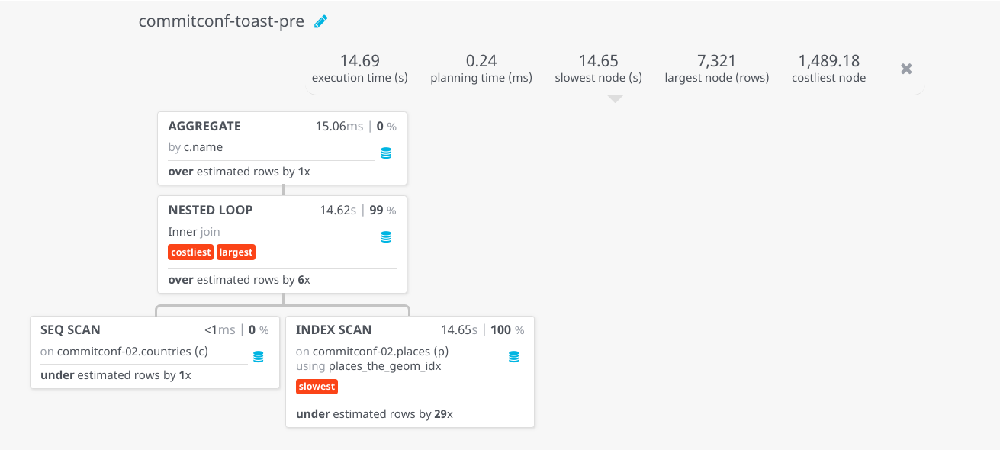
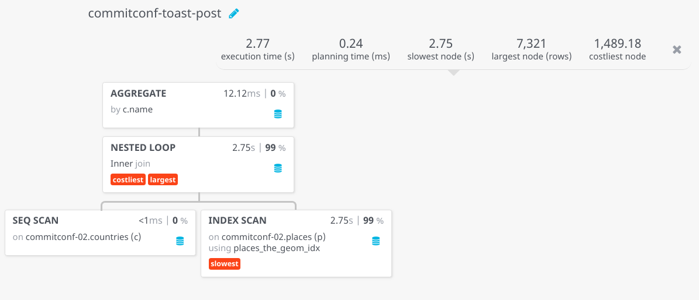

# Uncompressed TOAST

From [TOAST documentation](https://www.postgresql.org/docs/current/storage-toast.html):

> PostgreSQL uses a fixed page size (commonly 8 kB), and does not allow tuples to span multiple pages. Therefore, it is not possible to store very large field values directly. To overcome this limitation, large field values are compressed and/or broken up into multiple physical rows. This happens transparently to the user, with only small impact on most of the backend code. The technique is affectionately known as TOAST (or “the best thing since sliced bread”). The TOAST infrastructure is also used to improve handling of large data values in-memory.

This exercise is based on this [blog post](http://blog.cleverelephant.ca/2018/09/postgis-external-storage.html) from [Paul Ramsey](http://twitter.com/pwramsey).

## Set up

```sql
drop table if exists countries;
drop table if exists places;

create table countries as
select cartodb_id, name, the_geom
  from "commitconf-01".ne_10m_admin_0_countries;

create table places as
select * from "commitconf-01".ne_10m_populated_places;

create index on countries using gist(the_geom);
create index on places using gist(the_geom);
```

## TOAST

Let's check how many countries are above the Postgres page size (8192 bytes).

```sql
select count(*)
  from countries
 where ST_NPoints(the_geom) > (8192 / 16);
```

The size of the table is 6352 kilobytes.

```sql
select pg_size_pretty( pg_total_relation_size('countries') );
```

## Baseline

Let's do a simple check the number of places per polygon. This operation forces the database to access the full polygon geometries.

```sql
 explain analyze
  select count(*), c.name
    from countries c
    join places p
      on ST_Intersects(c.the_geom, p.the_geom)
group by c.name;
```

```text
HashAggregate  (cost=1794.47..1797.02 rows=255 width=18) (actual time=14690.076..14690.124 rows=224 loops=1)
  Group Key: c.name
  ->  Nested Loop  (cost=0.15..1588.58 rows=41179 width=10) (actual time=0.630..14675.323 rows=7321 loops=1)
        ->  Seq Scan on countries c  (cost=0.00..93.55 rows=255 width=34700) (actual time=0.035..0.745 rows=255 loops=1)
        ->  Index Scan using places_the_geom_idx on places p  (cost=0.15..5.85 rows=1 width=32) (actual time=1.613..57.439 rows=29 loops=255)
              Index Cond: (c.the_geom && the_geom)
              Filter: _st_intersects(c.the_geom, the_geom)
              Rows Removed by Filter: 71
Planning time: 21.540 ms
Execution time: 14691.428 ms
```

The regular `EXPLAIN ANALYZE` does not give much, but if we ask for more detail and use a tool to visualize the execution plan we can see that the majority of the time of the query is spent ont he `ST_Intersects` operation.



If we'd run a profiler on the execution we'd check that actually the time is mostly spent on decompressing the geometry from the `TOAST` rows, not doing any geometry computation.

## Change the storage

Let's change the way Postgres stores `TOAST` rows to ask for them to be stored without compression. To update our geometries for the `countries` table we only need to run a simple operation that will not modify the actual country polygons.

```sql
-- change the storage type
alter table countries
  alter column the_geom
  set storage external;

-- force the column to rewrite
update countries
   set the_geom = ST_SetSRID(the_geom, 4326);

-- Check the new size of the table
select pg_size_pretty(pg_total_relation_size('countries'));
```

The updated table now takes 15 megabytes of storage.

## Improved performance

Let's re-run the previous point-in-polygon operation:

```sql
 explain analyze
  select count(*), c.name
    from countries c
    join places p
      on ST_Intersects(c.the_geom, p.the_geom)
group by c.name;
```

```text
HashAggregate  (cost=1843.47..1846.02 rows=255 width=18) (actual time=2784.791..2784.842 rows=224 loops=1)
  Group Key: c.name
  ->  Nested Loop  (cost=0.15..1637.58 rows=41179 width=10) (actual time=0.647..2773.152 rows=7321 loops=1)
        ->  Seq Scan on countries c  (cost=0.00..142.55 rows=255 width=34700) (actual time=0.076..0.870 rows=255 loops=1)
        ->  Index Scan using places_the_geom_idx on places p  (cost=0.15..5.85 rows=1 width=32) (actual time=1.035..10.819 rows=29 loops=255)
              Index Cond: (c.the_geom && the_geom)
              Filter: _st_intersects(c.the_geom, the_geom)
              Rows Removed by Filter: 71
Planning time: 21.391 ms
Execution time: 2786.209 ms
```



We moved from 14.7 seconds to 2.8, that's a **5x** improvement at the cost of doubling the space used to store the polygons table.
